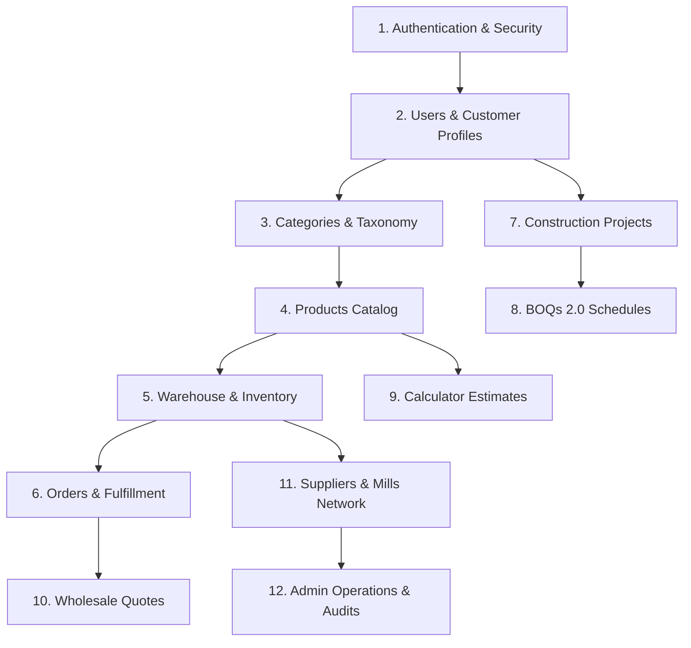

# HEPNA MART — Backend Architecture & Domain Integration Guide

**Document Version:** 1.0.0  
**Status:** Phase 2A Infrastructure Implemented  
**Date:** September 2026  

---

## 1. Multi-Tier System Architecture

HEPNA MART follows a clean, decoupled multi-tier architecture separating the client-side single-page application from the asynchronous Python REST service and relational storage engine.

```
┌─────────────────────────────────────────────────────────────┐
│                 React + Vite Frontend (SPA)                 │
│         Zustand State Stores & Tailwind UI Components       │
└──────────────────────────────┬──────────────────────────────┘
                               │ HTTPS / JSON REST Calls
                               ▼
┌─────────────────────────────────────────────────────────────┐
│                 FastAPI REST API Layer (v1)                 │
│      Routers, OpenAPI Validation, CORS, Rate Limiting       │
└──────────────────────────────┬──────────────────────────────┘
                               │ Pydantic v2 DTOs / Schemas
                               ▼
┌─────────────────────────────────────────────────────────────┐
│                    Service & Domain Layer                   │
│   Business Rules, RBAC Validation, Pricing & BOQ Algorithms │
└──────────────────────────────┬──────────────────────────────┘
                               │ Session Dependency
                               ▼
┌─────────────────────────────────────────────────────────────┐
│                  SQLAlchemy 2.x ORM Layer                   │
│          Declarative Models, Unit of Work, Alembic          │
└──────────────────────────────┬──────────────────────────────┘
                               │ psycopg2 / Connection Pool
                               ▼
┌─────────────────────────────────────────────────────────────┐
│                     PostgreSQL Database                     │
│      ACID Transactions, Relational Schemas, Constraints     │
└─────────────────────────────────────────────────────────────┘
```

---

## 2. Layer Responsibilities

### 2.1 Frontend Presentation Layer
- **Framework**: React 18 with TypeScript and Vite.
- **Client**: `src/lib/api.ts` provides typed HTTP primitives wrapping `fetch`.
- **State Transition**: During Phase 2A, the storefront uses local state; future subphases swap store persistence adapters to consume API responses seamlessly.

### 2.2 API & Routing Layer (`app/api/v1/`)
- **Framework**: FastAPI (Starlette + Pydantic v2).
- **Security**: JWT Bearer token authentication, HTTP Bearer scheme, and OAuth2 password flow.
- **Serialization**: Pydantic v2 `BaseModel` schemas for strict request payload validation and response filtering.
- **CORS**: Configurable cross-origin resource sharing allowing approved frontend origins.

### 2.3 Service Layer (`app/services/`)
- Encapsulates pure business logic away from HTTP request handlers.
- Manages complex transactions such as atomic stock reservations, BOQ line item pricing calculations, multi-vehicle site dispatch assignment, and wholesale discount tier evaluations.

### 2.4 Data Access & ORM Layer (`app/models/`, `app/core/database.py`)
- **ORM**: SQLAlchemy 2.0 style declarative mapping (`Mapped[T]`, `mapped_column()`).
- **Connection Management**: `SessionLocal` factory with connection pooling (`pool_pre_ping=True`, `pool_size=10`).
- **Migrations**: Alembic with automated revision detection against `Base.metadata`.

### 2.5 Storage Engine
- **RDBMS**: PostgreSQL 15+.
- **Data Integrity**: Foreign key cascades, unique compound indexes (e.g. `(project_id, slug)`), check constraints on positive prices, and automated timestamp triggers.

---

## 3. Systematic Phase 2 Migration Roadmap

The backend migration is structured into 12 sequential domain modules:



### Milestone Specifications

1. **Authentication (`/api/v1/auth`)**:
   - Argon2 password hashing.
   - Access & refresh token rotation.
   - User registration and login flows.

2. **Users / Customer Profiles (`/api/v1/users`, `/api/v1/business`)**:
   - Individual, Contractor, and Business profile extensions.
   - Team member invitations and permissions.
   - Construction site address directory.

3. **Categories (`/api/v1/categories`)**:
   - Hierarchical category and subcategory database tables.
   - Seeding from existing `categories.ts`.

4. **Products (`/api/v1/products`)**:
   - Material attributes, pricing, MRP, wholesale pricing tiers, specifications.
   - Seeding from existing `products.ts`.

5. **Inventory (`/api/v1/inventory`)**:
   - Real-time stock counts by warehouse yard.
   - Low-stock threshold alerts and restock triggers.

6. **Orders (`/api/v1/orders`)**:
   - Order creation, payment status, stage tracking, and site vehicle assignment.

7. **Projects (`/api/v1/projects`)**:
   - Project lifecycle management, location, and contractor assignment.

8. **BOQs (`/api/v1/boqs`)**:
   - Construction stage schedule lines, material allocation, and procurement status.

9. **Estimates (`/api/v1/estimates`)**:
   - Smart Construction Cost Calculator parametric inputs and historical pricing snapshots.

10. **Quotes (`/api/v1/quotes`)**:
    - Bulk RFQs, custom pricing negotiation, and quote approval workflow.

11. **Suppliers (`/api/v1/suppliers`)**:
    - Mill directory, dispatch lead times, and purchase order tracking.

12. **Admin Operations (`/api/v1/admin`)**:
    - System configuration, staff user management, role-based audit logs.
