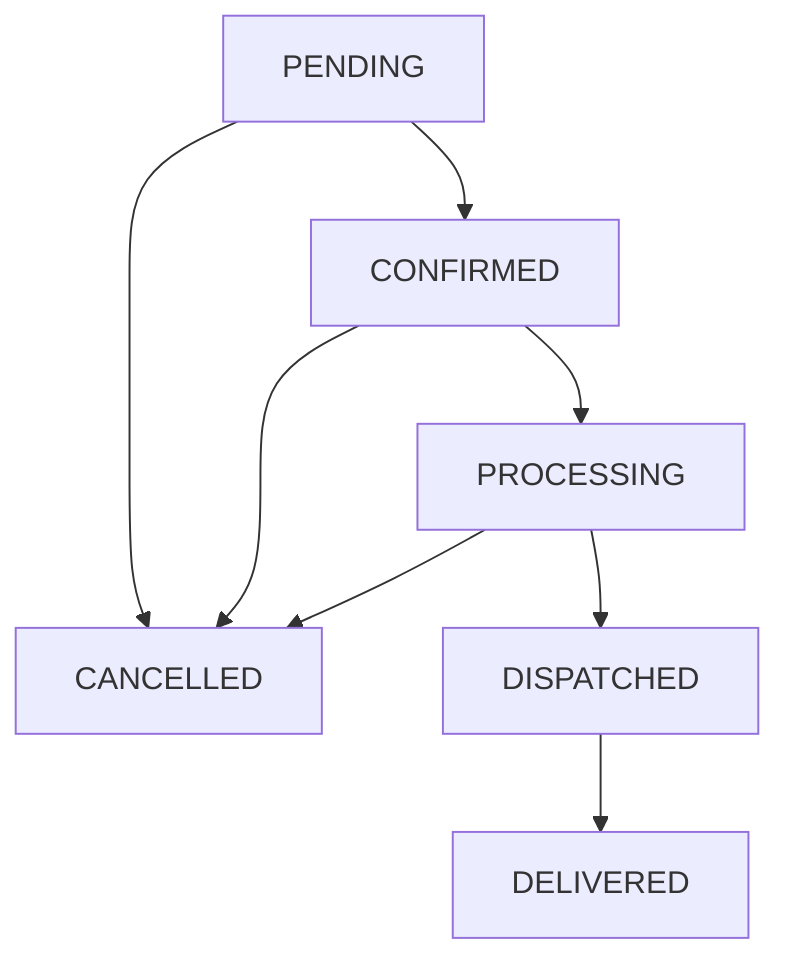

# HEPNA MART — Phase 2E: Real Orders + Checkout Backend Architecture

## 1. Executive Summary

Phase 2E transitions HEPNA MART from client-side order simulation into a high-reliability, PostgreSQL-backed asynchronous order and fulfillment engine.

Prior to Phase 2E, checkout, order generation, invoice rendering, and status timelines relied on browser `localStorage` state. Phase 2E establishes the backend as the single authoritative source of truth for all order placement, pricing calculations, GST assessments, stock validations, fulfillment lifecycles, and access control.

---

## 2. Core Architecture & Data Models

The order subsystem consists of three primary relational models persisted in PostgreSQL via SQLAlchemy 2.x and Alembic:

### A. `Order` Model (`orders` table)
- **Primary Key**: UUID (`id`)
- **Order Number**: Human-readable identifier format `HPN-YYYYMMDD-XXXX` (unique, indexed)
- **User Reference**: Foreign key to `users.id` with `current_user` ownership enforcement
- **Status Fields**:
  - `status`: `OrderStatus` (`PENDING`, `CONFIRMED`, `PROCESSING`, `DISPATCHED`, `DELIVERED`, `CANCELLED`)
  - `payment_status`: `PaymentStatus` (`PENDING`, `PAID`, `FAILED`, `REFUNDED`)
  - `payment_method`: `PaymentMethod` (`COD`, `ONLINE_PAYMENT`, `NEFT_RTGS`, `CREDIT_LINE`)
- **Centralized Monetary Calculations**:
  - `subtotal`: Sum of live line item prices
  - `delivery_charge`: Fixed rule engine (₹0 if subtotal > ₹5000, else ₹199)
  - `tax_amount`: Flat 18% GST calculation `round(subtotal * 0.18, 2)`
  - `discount_amount`: Applied coupon/promotional discount
  - `total_amount`: `subtotal + delivery_charge + tax_amount - discount_amount`
- **Delivery & Project Snapshot**:
  - `delivery_address`: Full recipient address, site contact, phone, and pincode
  - `delivery_type`: Delivery preference (`STANDARD`, `EXPRESS`, `SITE_DIRECT`)
  - `preferred_delivery_date`: Desired delivery date
  - `site_delivery_details`: JSONB snapshot of construction site parameters (e.g., project name, supervisor contact, gate access code, unloading vehicle type, heavy machinery access)
  - `customer_notes`: Optional delivery or procurement instructions
- **Tracking & Invoicing**:
  - `tracking_number`: Courier / fleet tracking ID
  - `invoice_number`: Commercial reference identifier `INV-YYYYMMDD-XXXX`
- **Audit Timestamps**: `created_at`, `updated_at`

### B. `OrderItem` Model (`order_items` table)
- **Primary Key**: UUID (`id`)
- **Order Reference**: Foreign key to `orders.id` (cascading delete on order removal)
- **Product Reference**: Foreign key to `products.id` (`ondelete="SET NULL"`)
- **Historical Snapshot Integrity**:
  - `product_title`: Historical product name at moment of purchase
  - `sku`: Product SKU at moment of purchase
  - `image_url`: Product primary image snapshot
  - `unit`: Measurement unit (e.g., Bags, Tonnes, Sq.Ft, Pieces)
  - `quantity`: Purchased unit quantity
  - `unit_price`: Unit price locked at time of checkout
  - `tax_rate`: GST rate locked at checkout (default 18.0)
  - `total_price`: `quantity * unit_price`

### C. `OrderStatusHistory` Model (`order_status_history` table)
- **Primary Key**: UUID (`id`)
- **Order Reference**: Foreign key to `orders.id`
- **Status Audit Trail**:
  - `status`: Target order status
  - `comment`: Contextual milestone notes (e.g., "Order placed successfully", "Cancelled by customer")
  - `changed_by`: UUID of the user or staff member initiating state transition
  - `created_at`: Exact timestamp of status modification

---

## 3. Atomic Checkout & Concurrency Controls

### Anti-Overselling via Row-Level Locking (`SELECT FOR UPDATE`)
To prevent race conditions during high-volume purchasing of limited construction materials, checkout implements atomic database transactions with row-level locking:

1. **Cart Lock & Validation**:
   - Cart items are fetched for the authenticated user.
   - If cart is empty, transaction immediately aborts with `400 Bad Request`.
2. **Row Locking**:
   - Each product's `Inventory` row is selected using `select(Inventory).filter_by(product_id=...).with_for_update()`.
   - Prevents concurrent transactions from reading stale stock numbers.
3. **Availability Verification**:
   - `inventory.available_quantity >= cart_item.quantity` must hold true.
   - If insufficient stock, transaction raises `400 Bad Request` with item-specific details and rolls back.
4. **Stock Decrement**:
   - `inventory.quantity` is immediately decremented by `cart_item.quantity`.
5. **Cart Flush & Order Generation**:
   - Items are removed from `cart_items`.
   - `Order`, `OrderItem` records, and initial `OrderStatusHistory` are committed in the same database transaction.

---

## 4. Order Lifecycle State Machine

The order lifecycle follows strict server-side transition rules:

### Transition & Invariant Rules:
1. **Customer Self-Service Cancellation**:
   - Allowed when status is `PENDING`, `CONFIRMED`, or `PROCESSING`.
   - Disallowed when order has transitioned to `DISPATCHED` or `DELIVERED`.
   - On cancellation, allocated inventory quantities are **automatically restored** (`inventory.quantity += item.quantity`).
2. **Staff Status Management**:
   - Internal staff with `orders.update` permission can advance orders through sequential fulfillment stages.
   - Terminal states (`DELIVERED`, `CANCELLED`) reject invalid status reversions.

---

## 5. Security & RBAC Enforcement

1. **Customer Ownership**:
   - `GET /api/v1/orders` and `GET /api/v1/orders/{id}` strictly query `WHERE user_id = current_user.id`.
   - Customer IDs in request payloads are ignored; identity is solely derived from validated JWT claims.
2. **Staff Privilege Boundaries**:
   - `GET /api/v1/admin/orders` and `PATCH /api/v1/admin/orders/{id}/status` require `is_staff = True` and appropriate RBAC permissions (`orders.view`, `orders.update`).
3. **Payment Integrity**:
   - Online payments remain marked as `PaymentStatus.PENDING` pending future gateway webhooks. No fraudulent claims of automated gateway success are permitted.
