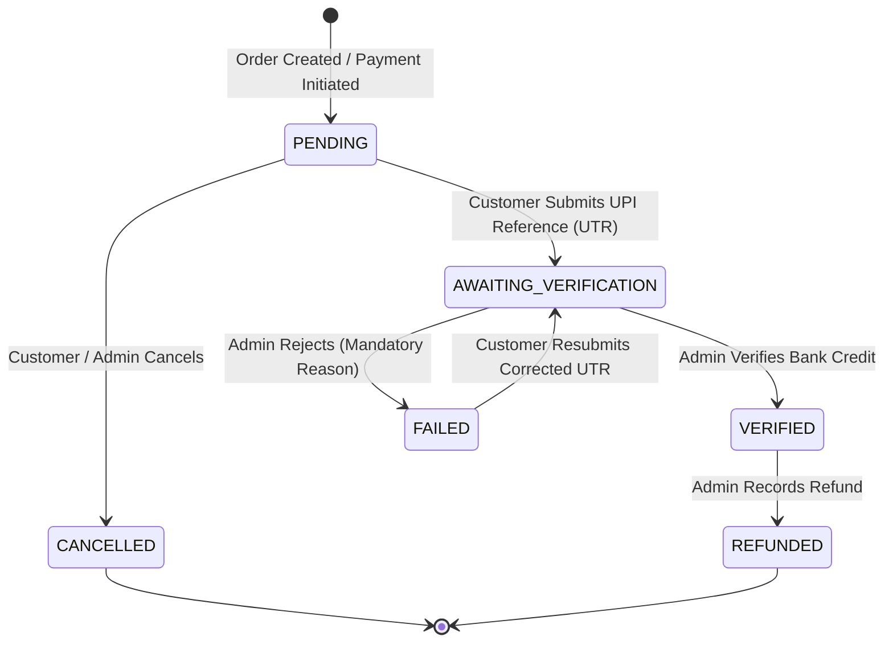

# HEPNA MART — Phase 2G Payment Architecture & Manual UPI Verification

## 1. Overview & Architectural Philosophy

Phase 2G introduces a production-grade, provider-agnostic Payment Architecture for HEPNA MART. It bridges checkout (Phase 2E) and wholesale quotes (Phase 2F) with real financial settlement tracking in PostgreSQL.

### Core Principles
1. **PostgreSQL Single Source of Truth**: All payment states, transaction references, amounts, and audit logs are authoritatively persisted in PostgreSQL.
2. **Server-Authoritative Financial Integrity**: Payment amounts are strictly retrieved from the authoritative `Order.total_amount` in PostgreSQL. Client-supplied amounts are never accepted or trusted.
3. **Strict Manual UPI Verification (No Fake Auto-Confirmation)**: In manual UPI mode, submitting a UPI reference ID (UTR) moves the payment to `AWAITING_VERIFICATION`. It is only marked `VERIFIED` when an authorized admin manually verifies the bank credit.
4. **Inventory Safety**: Stock reservation and deduction are handled strictly during order creation/quote acceptance. Payment verification does NOT decrement inventory, eliminating double-deduction risks.
5. **Immutable Event Auditing**: Every status change produces an append-only `PaymentEvent` record with actor ID, timestamp, transition metadata, and event details.
6. **Provider-Agnostic Extensibility**: Designed with an abstract `PaymentProvider` interface, allowing pluggable payment methods (Manual UPI, COD, and future automated gateways like Razorpay, Cashfree, Stripe) without altering core order or business models.

---

## 2. Payment State Machine & Lifecycle



### State Definitions:
- `PENDING`: Payment entity initialized; waiting for payment intent or reference submission.
- `AWAITING_VERIFICATION`: Customer completed UPI transfer and submitted 12-digit UTR/reference.
- `VERIFIED`: Authorized staff confirmed funds received in bank account; synchronizes order `payment_status` to `paid`.
- `FAILED`: Payment rejected due to invalid UTR, mismatched amount, or bank decline; synchronizes order to `failed`.
- `CANCELLED`: Payment abandoned or cancelled prior to verification.
- `REFUNDED`: Verified funds returned to customer (partial or full).

---

## 3. Database Schema Design (Alembic Migration 0006)

### `payments` Table
| Column | Type | Constraints / Details |
|---|---|---|
| `id` | `VARCHAR(36)` | Primary Key (UUIDv4) |
| `order_id` | `VARCHAR(36)` | Foreign Key -> `orders.id` (CASCADE), Indexed |
| `user_id` | `VARCHAR(36)` | Foreign Key -> `users.id` (CASCADE), Indexed |
| `payment_reference` | `VARCHAR(64)` | Unique internal reference (`PAY-YYYYMMDD-XXXXXX`), Indexed |
| `provider_reference` | `VARCHAR(128)` | External UTR / Gateway ID, Indexed |
| `provider` | `VARCHAR(32)` | `manual_upi`, `cod`, `razorpay`, `cashfree`, `stripe` |
| `payment_method` | `VARCHAR(32)` | `upi`, `cod`, `card`, `netbanking` |
| `payment_status` | `VARCHAR(32)` | `pending`, `awaiting_verification`, `verified`, `failed`, `cancelled`, `refunded` |
| `amount` | `NUMERIC(12, 2)` | Authoritative order total (`CHECK amount > 0`) |
| `currency` | `VARCHAR(10)` | Default `INR` |
| `failure_reason` | `TEXT` | Rejection / failure explanation |
| `verified_by_user_id`| `VARCHAR(36)` | Foreign Key -> `users.id` (SET NULL) |
| `verified_at` | `TIMESTAMP(TZ)`| Verification timestamp |
| `created_at` / `updated_at` | `TIMESTAMP(TZ)` | Automatic audit timestamps |

### `payment_events` Table (Immutable Audit Ledger)
| Column | Type | Description |
|---|---|---|
| `id` | `VARCHAR(36)` | Primary Key (UUIDv4) |
| `payment_id` | `VARCHAR(36)` | Foreign Key -> `payments.id` (CASCADE), Indexed |
| `event_type` | `VARCHAR(64)` | `PAYMENT_CREATED`, `PAYMENT_SUBMITTED`, `PAYMENT_VERIFIED`, `PAYMENT_REJECTED`, `PAYMENT_CANCELLED`, `PAYMENT_REFUNDED`, `RECONCILIATION_SYNC` |
| `old_status` | `VARCHAR(32)` | Status before transition |
| `new_status` | `VARCHAR(32)` | Status after transition |
| `provider_event_id` | `VARCHAR(128)` | Reference / UTR ID |
| `metadata_payload` | `JSON` | Structured event details (notes, reasons, refund amounts) |
| `created_by_user_id`| `VARCHAR(36)` | User or Admin performing the action |
| `created_at` | `TIMESTAMP(TZ)` | Immutable event timestamp |

---

## 4. Concurrency Control & Idempotency

### 1. Row-Level Locking (`SELECT FOR UPDATE`)
Verification, rejection, and UTR submission lock the target payment and order records to prevent race conditions during concurrent admin operations:
```python
payment = db.scalar(
    select(Payment).where(Payment.id == payment_id).with_for_update()
)
order = db.scalar(
    select(Order).where(Order.id == payment.order_id).with_for_update()
)
```

### 2. Verification Idempotency
Calling the verify endpoint multiple times on an already verified payment safely returns the verified state without generating duplicate events or mutating order statuses.

### 3. Duplicate UTR Protection
Submitting a UTR reference checks for existing active or verified payments with the same reference:
```python
duplicate = db.scalar(
    select(Payment).where(
        and_(
            Payment.id != payment.id,
            Payment.provider_reference == ref_clean,
            Payment.payment_status.in_([
                PaymentStatus.AWAITING_VERIFICATION.value,
                PaymentStatus.VERIFIED.value,
            ]),
        )
    )
)
```

---

## 5. Server-Side RBAC Integration

Permissions are managed centrally in `backend/app/core/rbac.py` and enforced via FastAPI dependencies:

| Permission | Description | Allowed Roles |
|---|---|---|
| `PAYMENTS_VIEW` | View payment lists and audit events | `SUPER_ADMIN`, `ADMIN`, `ORDER_MANAGER`, `SUPPORT_STAFF` |
| `PAYMENTS_VERIFY` | Approve manual UPI payments | `SUPER_ADMIN`, `ADMIN`, `ORDER_MANAGER` |
| `PAYMENTS_REJECT` | Reject submitted payments with reason | `SUPER_ADMIN`, `ADMIN`, `ORDER_MANAGER` |
| `PAYMENTS_REFUND` | Issue refund records | `SUPER_ADMIN`, `ADMIN` |

Customers can only create, view, and submit UTRs for their own orders (enforced via customer user isolation checks).

---

## 6. Payment Reconciliation Engine

The `PaymentReconciliationService` detects and repairs status discrepancies between `payments` and `orders`:
- **Detection**: Identifies any order whose `payment_status` disagrees with the latest payment state.
- **Repair**: Allows admins to execute transactional sync (`/admin/payments/{payment_id}/reconcile`), restoring order state and appending a `RECONCILIATION_SYNC` audit event.

---

## 7. Webhook & Future Gateway Readiness

The architecture is prepared for automated payment gateways (e.g. Razorpay / Cashfree):
1. **Endpoint**: `POST /api/v1/payments/webhooks/{provider}`
2. **Provider Factory**: `get_payment_provider(provider_name)` delegates incoming webhooks to the corresponding provider's `handle_webhook(db, payload, signature)` method.
3. When automated providers are configured, webhooks will verify cryptographic signatures and transition payments directly to `VERIFIED` or `FAILED`.
